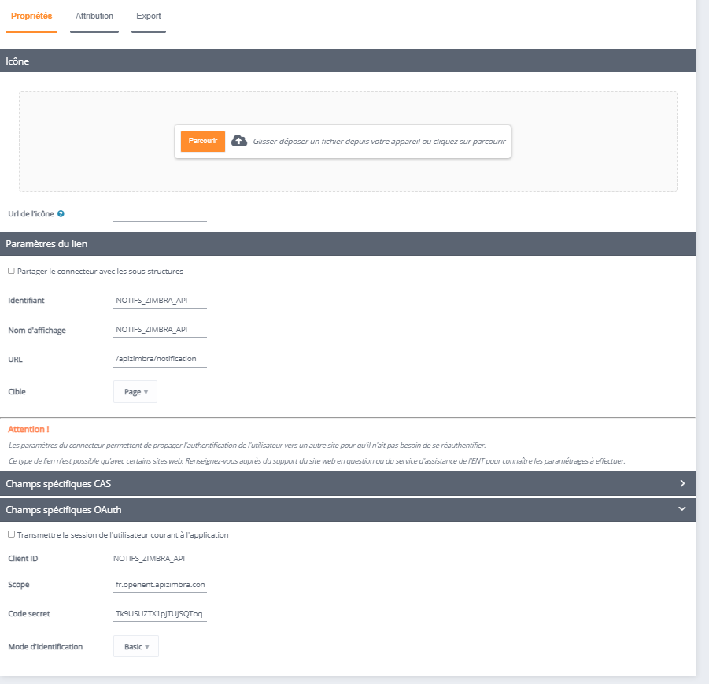

# About Zimbra Connector
* Licence : [AGPL v3](http://www.gnu.org/licenses/agpl.txt) - Copyright Région Ile de France, CGI
* Développer(s) : CGI
* Financer(s) : Région Ile de France, CGI
* Description : Module to connect to Zimbra.

## Circuit Breaker, protect eventloop if zimbra doesn't respond
* maxFailures : max bad request before open circuit
* timeout : max timeout request befoe open request (-1 disable)

## Address Book Sync
Address Book of user is sync when user log on zimbra expert mode
Addess Book of a structure is sync when a user of this structure lo on zimbra expert mode

* enable-addressbook-synchro : is addressbook sync to zimbra enabled ? (default true)
* shared-folder-name : name of created addess book root folder (defaut -- Carnets Adresses ENT --)
* abook-sync-ttl-minutes : delay in minutes between two sync of AdressBook of a user (default 1440)
* structure-abook-sync-delay : delay (with postgres syntax) between two sync of adressBook of a structure (default '1 day')
* force-synchro-adressbook : if true, even if user should respect rights&grants rules, all adressbook of structure is shared with users (default false)
* purge-emailed-contacts :

## Configuration 
The zimbra-connector module contains several modules within it: apizimbra and zimbra.

### Apizimbra
<pre>
{
  "config": {
    ...
    "zimbra-uri" : "$zimbraUri",
    "zimbra-domain" : "$zimbraDomain",
    "zimbra-synchro-lang" : "$zimbraLang",
    ...
  }
}
</pre>

Specific configuration that must be seen :

<pre>
zimbraUri = ${String}
zimbraDomain = ${String}
zimbraLang = ${String}
</pre>

### zimbra

<pre>
{
  "config": {
    ...
    "max-recipients": $zimbraMaxRecipients,
    ...
    "zimbra-uri" : "$zimbraUri",
    "preauth-key" : "$zimbraPreauthKey",
    "zimbra-domain" : "$zimbraDomain",
    "zimbra-synchro-lang" : "$zimbraLang",
    "zimbra-admin-uri" : "$zimbraAdminUri",
    "admin-account" : "$zimbraAdminAccount",
    "address-book-account" : "$zimbraAddressBookAccount",
    "admin-password" : "$zimbraAdminPassword",
    "zimbra-synchro-cron" : "$zimbraSynchroCron",
    "zimbra-recall-cron": "$zimbraRecallCron",
    "zimbra-ical-cron" : "$zimbraICalCron",
    "zimbra-recall-worker-max-queue": $zimbraRecallWorkerMaxQueue,
    "zimbra-ical-worker-max-queue" : $zimbraICalWorkerMaxQueue,
    "zimbra-file-upload-max-size": $zimbraFileUploadMaxSize,
    "mail-config" : {
      "imaps":{
        ...
      },
      "smtps":{
        ...
      }
    },
    ...
    "purge-emailed-contacts" : $zimbraPurgeEmailedContacts,
    "force-synchro-adressbook" : $zimbraForceSyncAdressBook,
    "save-draft-auto-time" : $saveDraftAutoTime,
    "filter-profile-sync-ab" : $filterProfileSyncAB,
    ...
    "slack": {
      "api-uri": "$zimbraSlackApiUri",
      "api-token": "$zimbraSlackApiToken",
      "channel": "$zimbraSlackChannel",
      "bot-username": "$zimbraSlackBotUsername"
    }
  }
}

</pre>

Specific configuration that must be seen :

<pre>
zimbraMaxRecipients = Integer
zimbraUri = ${String}
zimbraPreauthKey = ${String}
zimbraDomain = ${String}
zimbraLang = ${String}
zimbraAdminUri = ${String}
zimbraAdminAccount = ${String}
zimbraAddressBookAccount = ${String}
zimbraAdminPassword = ${String}
zimbraSynchroCron = ${String}
zimbraRecallCron = ${String}
zimbraICalCron = ${String}
zimbraFileUploadMaxSize= ${Integer}
zimbraPurgeEmailedContacts = boolean
zimbraForceSyncAdressBook = boolean
saveDraftAutoTime = ${String}
sendTimeout = ${String}
filterProfileSyncAB = ${String}
zimbraSlackApiUri = ${String}
zimbraSlackApiToken = ${String}
zimbraSlackChannel = ${String}
zimbraSlackBotUsername = ${String}
</pre>

you can add the following properties depending on your use of zimbra : 

<pre>
{
  ...
  circuit-breaker: { },
  ...
  cwd: ${String},
  assets-path: ${String}
}
</pre>

Explanation of the previous parameters :

    mod parameter                   :  conf.properties variable         ,   usage
    -------------------------------------------------------------------------------------------------------------------
    -------------------------------------------------------------------------------------------------------------------
    "zimbra-ical-cron"              : "${zimbraICalCron}"               , update frequency for ical queue
    "zimbra-recall-cron"            : "${zimbraRecallCron}"             , update frequency for recall queue
    "zimbra-ical-worker-max-queue"  : "${zimbraICalWorkerMaxQueue}"     , max queue size for ical request worker
    "zimbra-recall-worker-max-queue": "${$zimbraRecallWorkerMaxQueue}"  , max queue size for recall request worker

## API Zimbra Notif

Create a connector to enable zimbra to communicate with zimbra-connector to send notifications once the operation is complete.

### Configuration
<pre>
id: NOTIFS_ZIMBRA_API
URL: ${host}/apizimbra/notification
clientID: NOTIFS_ZIMBRA_API
Scope: fr.openent.apizimbra.controller.ApiController|sendNotification
Code Secret: Tk9USU2Tx1pjTUJSQToq
</pre>

The username and password will be "notifent_user" et "notifent_password".